# School_District_Analysis

## Overview
Due to the dishonesty of ninth grade of Thomas High school, we need to recreate the analysis for school district and replace all the ninth grade reading and math scores to NaN. After completing the project, we would have a better view of the real fact of school district analysis.

## Results
### District Summary 
|Original District Summary                         | New District Summary                                    |
|:----------:                                      |                                :-----------------------:|
|                              |                                     |
* All the factors decreased a little bit except the average reading score.

### School Summary
|Original School Summary                           | New School Summary                                    |
|:----------:                                      |                                :-----------------------:|
|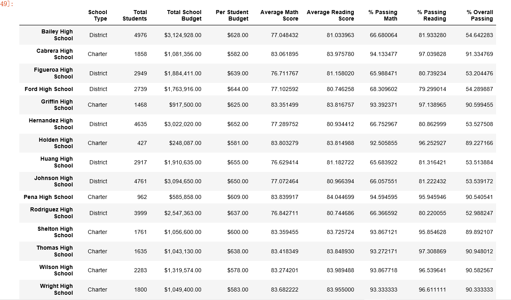                              |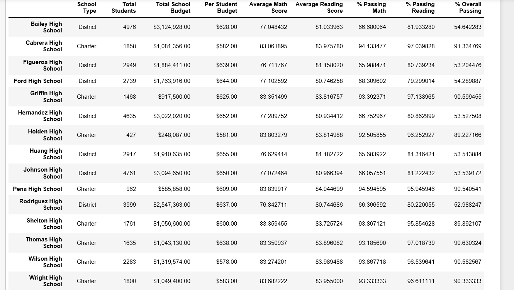                                     |
* The school summary result is not affected so much. The average math score went down a litte bit but the average reading score went up slightly. The rest of them stay the same.

### How does replacing the ninth graders’ math and reading scores affect Thomas High School’s performance relative to the other schools?
* Overall, replacing the ninth graders' math and reading scores do not affect Thomas High School's performance that much. The influence is negligible.

### Math and reading scores by grade
|Original Math Score                               | New Math Score                                          |
|:----------:                                      |                                :-----------------------:|
|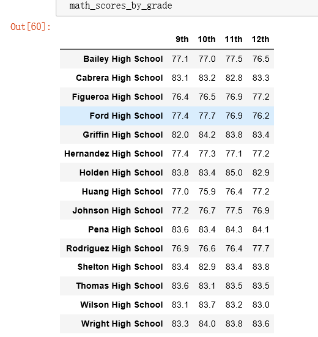                          |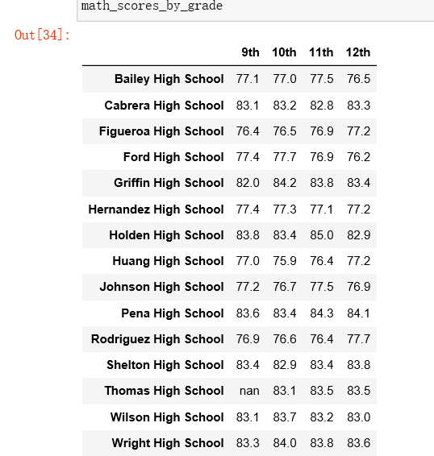                                 |
* Expect the difference of ninth graders scores, the scores of 10th,11th and 12th stay almost the same.

|Original Reading Score                            | New Reading Score                                       |
|:----------:                                      |                                :-----------------------:|
|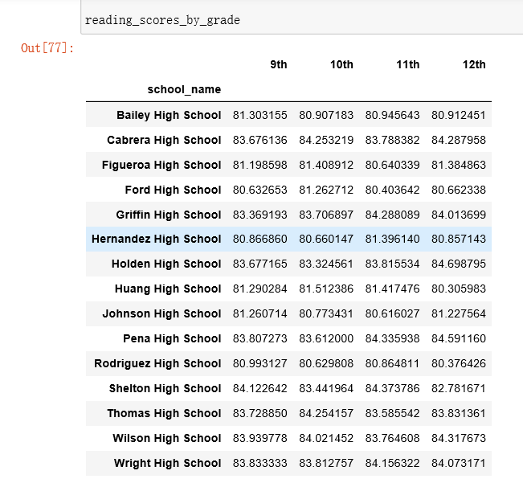                       |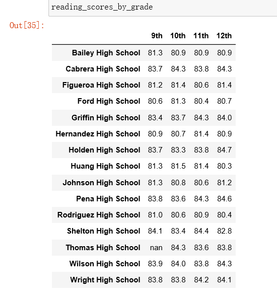                              |
* For the reading scores, they also stay almost the same, with very little differences.
### Scores by school spending
|Original Scores by School Spending                | New Scores by School Spending                           |
|:----------:                                      |                                :-----------------------:|
|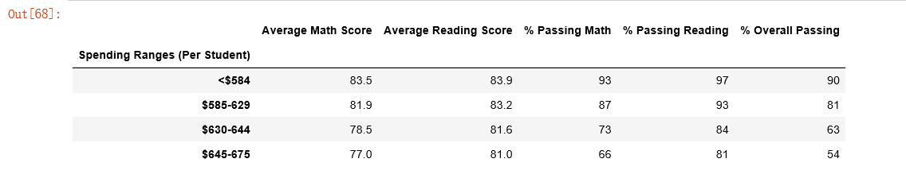                      |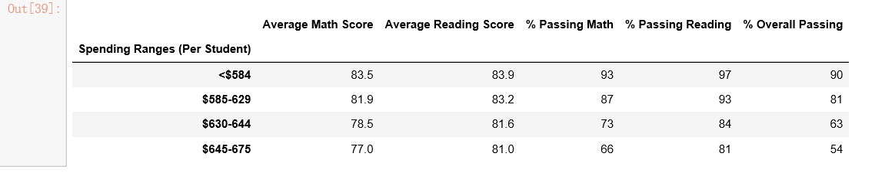                             |
* The scores by school spending remain the same as well.
###  Scores by school size
|Original Scores by School Size                    | New Scores by School Size                               |
|:----------:                                      |                                :-----------------------:|
|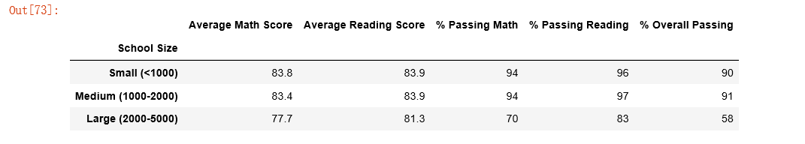                          |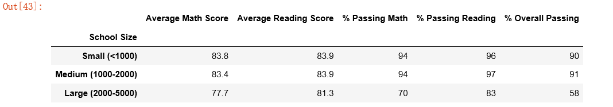                                 |
* The scores by school size remain the same as well.
### Scores by school type
|Original Scores by School Type                    | New Scores by School Type                               |
|:----------:                                      |                                :-----------------------:|
|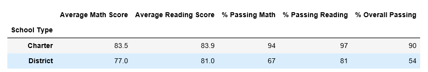                          |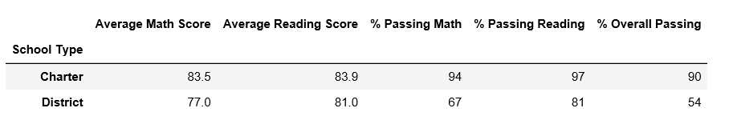                                 |
* The scores by school type remain the same as well.

## Summary
Overall, there is no significant scores change for different aspects of school district analysis after replacing all the ninth graders' scores. The number of student is also removed when removing their scores. It does not affect the overall performance that much.

